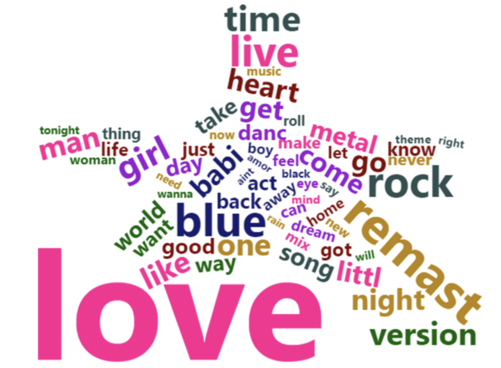

```{r connect to database, , echo=FALSE, eval=TRUE, results='hide', warning = FALSE, message = FALSE}

# Libraries
library(RMySQL)
library(knitr)
library(xtable)
library(kableExtra)
library(RMariaDB)
library(DBI)
library(ggplot2)
library(dplyr)
library(reshape2)


# Constants
DECADE_ORDER <- c("60s\r", "70s\r", "80s\r", "90s\r", "00s\r", "10s\r")

options(xtable.comment = FALSE) #### prevents commenting when printing xtable latex

projpath <- getwd()

if(!exists("xdbsock")) {
    xdbsock <- ""
    cat("\n", 
        "Parameter 'xdbsock' not found, setting to empty string for general usage", 
        "\n")
}

drv <- dbDriver("MySQL") # create driver object


# connect to Jeremy's database
db_host <- Sys.getenv("db_read_endpoint")
db_user <- Sys.getenv("db_read_user")
db_pw   <- Sys.getenv("db_read_password")
db_port <- Sys.getenv("db_read_port")
db_name <- Sys.getenv("db_read_db")
db_drv  <- RMariaDB::MariaDB()

con <- dbConnect(db_drv, user=db_user, password=db_pw, dbname=db_name, host=db_host, port=db_port)

dbListTables(con) # see what tables we have 

dbGetInfo(con)
```

\newpage 

# Abstract

Write something

\newpage

# Introduction

REWRITE TO DESCRIBE QUESTION OF INTEREST

We analyze a database of Spotify tracks that have had attributes assigned to them algorithmically by Spotify. These attributes act as descriptors for each track and allow us to group similar tracks and identify potentially interesting information and trends in the data. We have used this to analyze the songs in the Spotify database for what we found to be the most interesting questions. In the following sections we will cover the data more in depth, describe our methodology for exploring the data, and present our final analyses.


\vspace{12pt}


# Data Description

We conducted our analysis using a dataset compiling various music features for songs found on Spotify's Web API[1]. This data was obtained by sampling two different subsets of songs, hits and flops, from 1960-2019. Hits are defined as any song that made a top 100 'hit' list any week in a given decade. Flops are defined as the opposite, with additional requirements such as belonging to a genre considered non-mainstream or avant-garde. While the original purpose of this dataset was to predict whether or not a song will be successful, we will be utilizing the musical attributes to analyze the change in music over time. Since this dataset is stratified at the track level, each track acts as a unique unit of observation. With over 40,000 unique songs spread evenly across six decades, it provides plenty of information to analyze the changes in musical attributes across the last several years.

\vspace{12pt}

The majority of these variables are generated by Spotify's music analytic algorithm, which is unknown to the general public. Therefore, we have provided documentation to get a fairly robust understanding of the variables. The definitions for all our variables can be found in the attached JSON file as well as in the dataDictionary table when connected to the database instance. 

# Methodology

This work uses a variety of analytical techniques to explore the data and answer small questions about the music we all like and listen to. First we will display and discuss what terms appear most often in music titles. The idea of specific pictures and words in titles to get views has become commonplace in online videos and likely is no different in music as well. Although we could note simply display the most common words, the text needed to be cleaned first. Therefore we use the tm[2] package and tidytext[3] to clean the song titles. We made all text lowercase, removed non-alphabet characters,  removed all punctuation, removed stop words, and then stemmed the document. Stop words exist simply as determiners to mark nouns like “the'', or coordinating conjunctions like “but”, or prepositions like “in”. Although these terms help to form a language, they do not hold any meaning for our song titles. Therefore, we removed them. After that we stemmed the text. This process altered words to help make them return to their roots. An example in our data was changing “remastered”, “remaster”, and “remastering” to “remast”. This allowed us to see each term as the same. Once these steps were completed, we used a word cloud. This was only the first method to learn about the data.

Our next method involved multiple sets of univariate analysis. Investigating how the data was distributed could help reinforce the prevalence of musical standards. To do this analysis we used tables to help get a concrete understanding of the bins. In categorical variables this allows us not only to see how the bins are filled, but to immediately compare them to their neighbors. Our final type of analysis is bivariate.

We used a visual analysis to see how music changed over the decades and when more sections get added. [I NEED TO SEE WHAT PEOPLE TO TALK ABOUT THIS MORE. I ALSO DON’T KNOW HOW LISA IS TACKLING THE DANCEABILITY STUFF SO THAT WILL NEED TO BE ADDED LATER]


\newpage 

# Analysis

## Music Theory Attributes

To get a better understanding of some of the music-related variables in our dataset, we will also explore three very important music theory concepts: tempo, time signature, and key signature. 

### Tempo

Tempo describes the speed/pace of a song. In general, fast tempos evoke more positive emotions such as happiness and delight while slow tempos evoke negative emotions such as sadness and depression. To get an idea of the artists that tend to convey postive emotions compared to those that channel negative emotions, we will take a look at the top 10 artists with the fastest average tempos as well as the top 10 with the slowest. 

```{r, echo=FALSE, eval=TRUE, results='asis', warning=FALSE}

qstr <-
paste0(
"
select artist
		, avg(tempo) avg_song_tempo
        , COUNT(DISTINCT track) count_songs
from music
group by artist
HAVING  count_songs >= 10
order by avg_song_tempo desc
limit 10
")

df1 <- dbGetQuery(con, qstr)

colnames(df1) <- c("Artist", "Average Song Tempo", "Total Number of Songs")


# kable 
if( opts_knit$get('rmarkdown.pandoc.to') %in% 'html' ) {
  xxtb <- kable( df1, format='html', table.attr = "style='width:40% ;'"  )
  xxtb
  #kable_styling(xxtb)
}
if( opts_knit$get("rmarkdown.pandoc.to") %in% "latex" ) {
  ###### "{ }\\" -- try to create some vertical space
  xcaption <- paste0("Top 10 Artist/Bands with the Fastest Average Tempos")
  rownames(df1) <- NULL
  
  xxMM <- kable(df1, format="latex", caption = xcaption, booktabs = TRUE, longtable = TRUE)

  kable_styling(xxMM, latex_options= c("hold_position","striped"), latex_table_env="longtable", repeat_header_text = "\\textit{(continued)}", repeat_header_continued = TRUE, position = "center", font_size = 9)
}


```

### Time Signature

Time signature indicates the rhythm of the song in terms of a beat's duration and the number of beats per measure. While it can get fairly technical, it is important to know that the most common time signature is 4 beats per measure (and is hence referred to as 'common time'). In fact, 88% of our dataset is made up of songs with common time. Compared to the other time signatures, common time has higher averages for danceability and energy but lower averages for acousticness. This time signature also has the highest success rate for hit songs with 43% of common time songs getting classified as a hit. As seen from the average rates in the table below, the success behind this time signature can be attributed to these songs being easier for people to dance to. Therefore, this table indicates that successful hit songs tend to higher levels of dancibility and energy. 

```{r, echo=FALSE, eval=TRUE, results='asis', warning=FALSE}
# 36117/40886

qstr <-
paste0(
"
 select time_signature
        , avg(danceability) avg_danceability
        , avg(acousticness) avg_acousticness
        , avg(energy) avg_energy
        , count(*) count_tracks
        , SUM(hit) count_hits
        , SUM(hit)/count(*) as percentage_hit
FROM music
group by time_signature
order by count_tracks desc
")

df3 <- dbGetQuery(con, qstr)

colnames(df3) <- c("Time Signature", "Average Danceability", "Average Acousticness", "Average Energy", "Number of Tracks", "Number of Hits", "Percentage of Hit Tracks")

df3 <- t(df3)

# kable 
if( opts_knit$get('rmarkdown.pandoc.to') %in% 'html' ) {
  xxtb <- kable( df3, format='html', table.attr = "style='width:40% ;'"  )
  xxtb
  #kable_styling(xxtb)
}
if( opts_knit$get("rmarkdown.pandoc.to") %in% "latex" ) {
  ###### "{ }\\" -- try to create some vertical space
  xcaption <- paste0("Summary of Time Signature Characteristics")
  colnames(df3) <- NULL
  
  xxMM <- kable(df3, format="latex", caption = xcaption, booktabs = TRUE, longtable = TRUE)

  kable_styling(xxMM, latex_options= c("hold_position","striped"), latex_table_env="longtable", repeat_header_text = "\\textit{(continued)}", repeat_header_continued = TRUE, position = "center", font_size = 9)
}
```

\newpage 

### Key Signature 

Key signature describes the combination of sharps and flats that determine the scale of a piece of music. In general, most songs shift from key to key to add variance and intrigue but this dataset simply estimates the overall key. As the table below indicates, the estimated key does not have a large effect on the success rate of songs since the 'Percentage of Hit Tracks' varies around 40% for each key.

```{r, echo=FALSE, eval=TRUE, results='asis', warning=FALSE}

qstr <-
paste0(
"
select song_key
        , avg(danceability) avg_danceability
        , avg(acousticness) avg_acousticness
        , avg(energy) avg_energy
        , count(*) count_tracks
        , SUM(hit) count_hits
        , SUM(hit)/count(*) as percentage_hit
FROM music
group by song_key
order by count_tracks desc
")

df4 <- dbGetQuery(con, qstr)

df4 <- df4[order(df4$song_key),c(1,2,3,4,7)]
df4$song_key <- c("C", "C#/Db", "D", "D#/Eb", "E","F", "F#/Gb","G", "G#/Ab","A", "A#/Bb","B")

colnames(df4) <- c("Key Signature", "Average Danceability", "Average Acousticness", "Average Energy", "Percentage of Hit Tracks")

# kable 
if( opts_knit$get('rmarkdown.pandoc.to') %in% 'html' ) {
  xxtb <- kable( df4, format='html', table.attr = "style='width:40% ;'"  )
  xxtb
  #kable_styling(xxtb)
}
if( opts_knit$get("rmarkdown.pandoc.to") %in% "latex" ) {
  ###### "{ }\\" -- try to create some vertical space
  xcaption <- paste0("Summary of Key Signature Characteristics")
  rownames(df4) <- NULL
  
  xxMM <- kable(df4, format="latex", caption = xcaption, booktabs = TRUE, longtable = TRUE)

  kable_styling(xxMM, latex_options= c("hold_position","striped"), latex_table_env="longtable", repeat_header_text = "\\textit{(continued)}", repeat_header_continued = TRUE, position = "center", font_size = 9)
}
```

## Top Artists per Decade

We continue our exploratory data analysis by checking who the top 5 artists or bands are in each decade. For the purpose of this analysis over time, the top artists are defined in terms of total amount of songs created. 

```{r, echo=FALSE, eval=TRUE, results='asis', warning=FALSE}

qstr <-
paste0(
"
SELECT *
 FROM (
	 select artist
			, decade
			, COUNT(DISTINCT track) count_songs
			, ROW_NUMBER() OVER(PARTITION BY decade ORDER BY COUNT(DISTINCT track) desc) as rn
	from music
	group by artist, decade
	order by count_songs desc) x
WHERE rn <= 5
order by decade, rn
")

df2 <- dbGetQuery(con, qstr)
df2 <- df2[,1:3]

colnames(df2) <- c("Artist", "Decade", "Total Number of Songs")

df2_1 <- df2[1:10,]
df2_2 <- df2[-(1:10),]
df2 <- rbind(df2_2,df2_1)


# kable 
if( opts_knit$get('rmarkdown.pandoc.to') %in% 'html' ) {
  xxtb <- kable( df2, format='html', table.attr = "style='width:40% ;'"  )
  xxtb
  #kable_styling(xxtb)
}
if( opts_knit$get("rmarkdown.pandoc.to") %in% "latex" ) {
  ###### "{ }\\" -- try to create some vertical space
  xcaption <- paste0("Top 5 Artist/Bands with the Most Songs per Decade")
  rownames(df2) <- NULL
  
  xxMM <- kable(df2, format="latex", caption = xcaption, booktabs = TRUE, longtable = TRUE)

  kable_styling(xxMM, latex_options= c("hold_position","striped"), latex_table_env="longtable", repeat_header_text = "\\textit{(continued)}", repeat_header_continued = TRUE, position = "center", font_size = 9)
}


```
## Danceability 
```{r}
db<- "
SELECT * FROM music;"
data <- dbGetQuery(con, db)


danceable <- data[,5:19] 

danceable %>% 
  cor() %>% 
  corrplot::corrplot(method = 'color',
                     order = 'hclust',
                     type = 'lower',
                     addCoef.col = 'black',
                     number.cex = .5,
                     number.digits = 1.)

# Most negatively correlated with danceability
c1 <- danceable %>% ggplot(aes(acousticness, danceability)) + geom_jitter(color = "red", alpha = 0.3) + geom_smooth(color = "black")
c2 <- danceable %>% ggplot(aes(instrumentalness, danceability)) + geom_jitter(color = "blue", alpha = 0.3) + geom_smooth(color = "black")

ggpubr::ggarrange(c1, c2)

# Most positively correlated with danceabiity
c3 <- danceable %>% ggplot(aes(loudness, danceability)) + geom_jitter(color = "purple", alpha = 0.3) + geom_smooth(color = 'black')


```


## More Stuff

Like music our analysis is multifaceted, but we will begin by looking at the titles of songs. The way that important words were isolated has been discussed, so after cleaning the data we used the wordcloud2[4] package to create the word star below.  



There are a number of takeaways from the above plot, but we will start by asking a decades old question, what has love got to do with it? Well it appears love has a lot to do with titles, this word appears over 2000 times, more than the next two most common words combined. This makes sense as it is both a powerful emotion, as well as its own genre in a way. In fact, we see that love songs are not the only emotional genre listed. The word blue, or the blues is often a sadder style of music named after the emotion. This leads us to note that more emotive phrases are popular in titles. Next we note that there is another topic besides feelings that are common in titles.
          	
Descriptions of people appear to be the second most common terms in a title. This is reflected by the number of times a title has “man”, “girl”, “babi”, or “boy”. Often people like to talk about themselves and each other, this seems to hold true for our music as well.  So when title a piece it seems that the most common practices are to talk about how the artist feels and their relationships to others. Now that we looked at names and titles we will move on to explore the actual music itself.

```{r echo=FALSE, eval=TRUE, results='hide', warning=FALSE, message = FALSE}
query5 <- "
SELECT 
  decade
  , danceability
  , liveness
  , duration_ms / 60000 AS duration -- Convert to minutes
FROM
  music
WHERE
  hit = '1'

;
"

query6 <- "
SELECT 
  decade
  , AVG(duration_ms / 60000) AS avg_duration -- Convert to minutes
  , STD(duration_ms / 60000) AS sd_duration
FROM 
  music
WHERE 
  hit = '1'
GROUP BY 
  decade

;
"

result5 <- dbGetQuery(con, query5)
result6 <- dbGetQuery(con, query6)

ggplot(data = result5, 
       aes(x = factor(decade, level = DECADE_ORDER), y = duration, color = decade)) +
  geom_point(position = position_jitter(w = 0.2)) +
  geom_errorbar(data = result6, mapping = aes(x = decade, y = avg_duration,
                  ymin = avg_duration - sd_duration,
                  ymax = avg_duration + sd_duration
                  ),
                color = 'black', width = 0.2) + 
  geom_point(data = result6, aes(x = decade, y = avg_duration), color = 'black') +
  labs(title = "Duration of Hit Tracks by Decade") +
  xlab("Decade") +
  ylab("Duration (minutes)") +
  theme(legend.position = "none", plot.title = element_text(hjust = 0.5))

ggsave("Duration_By_Decade.png", device = "png", path = "plots")
```
          	
The duration of hit tracks has mostly stayed under 10 minutes with an average closer to 4 minutes across the decades. The notable exception is in the 1970s, possibly due to the popularity of Progressive Rock during those years with its blending of Rock and Jazz Fusion into long drawn out concept albums and longer-winded tracks.

```{r echo=FALSE, eval=TRUE, results='hide', warning=FALSE, message = FALSE}
mode_query <- "
SELECT 
  CASE 
    WHEN decade = '60s\r' THEN '1960'
    WHEN decade = '70s\r' THEN '1970'
    WHEN decade = '80s\r' THEN '1980'
    WHEN decade = '90s\r' THEN '1990'
    WHEN decade = '00s\r' THEN '2000'
    WHEN decade = '10s\r' THEN '2010'
    ELSE 'Unknown Decade'
  END
  , song_mode
FROM 
  music
WHERE
  hit = '1'
  
;
"

mode_result <- dbGetQuery(con, mode_query)
names(mode_result) <- c('decade', 'song_mode')

# Calculate proportions of each mode by decade
mode_proportions_by_decade <- mode_result %>%
  group_by(decade, song_mode) %>%
  summarize(n = n()) %>%
  mutate(mode_percent = n / sum(n) * 100)


ggplot(data = mode_proportions_by_decade, 
       aes(x = as.numeric(decade), y = mode_percent, fill = factor(song_mode))
       ) +
  geom_bar(stat = "identity") +
  labs(title = "Proportion of Major/Minor Hit Tracks by Decade") +
  xlab("Decade") + 
  ylab("Percentage") +
  scale_fill_manual(name = "Mode", # Legend options
                    labels = c("Minor", "Major"), 
                    values = c("#619CFF", "#F8766D"))+
  theme(plot.title = element_text(hjust = 0.5))

ggsave("Mode_By_Decade.png", device = "png", path = "plots")
```


The proportion of hit songs in the minor mode has increased from about 15% in the 1960s to almost 30% in the 2010s. The minor mode generally sounds more sad, while the major has a happier sound--this may indicate that people have developed more of a taste for sad popular music over the years.

```{r echo=FALSE, eval=TRUE, results='hide', warning=FALSE, message = FALSE}
overview_query <- "
SELECT
  decade
  , danceability
  , energy
  , speechiness
  , acousticness
  , valence
FROM
  music
WHERE
  hit = '1'
"

overview_result <- dbGetQuery(con, overview_query)

avg_traits_by_decade <- overview_result %>%
  group_by(decade) %>%
  summarize_all("mean") %>%
  melt(id = "decade")

ggplot(data = avg_traits_by_decade, 
       aes(x = factor(decade, level = DECADE_ORDER), 
           y = value, color = variable)
       ) +
  geom_line(aes(group = variable), size = 1) +
  geom_point() +
  labs(title = "Traits of Hit Tracks by Decade") +
  xlab("Decade") +
  ylab("Value") +
  scale_y_continuous(limits = c(0, 1.0)) +
  theme(legend.title = element_blank(), plot.title = element_text(hjust = 0.5))

ggsave("Traits_By_Decade.png", device = "png", path = "plots")
```


There are a few noticeable trends in the qualities of hit music across the decades as assigned by Spotify. The use of acoustic as opposed to electric instruments of tracks declined significantly from the 60’s onward, as more and more electronic instruments were developed and put to widespread use. Danceability, energy, and speechiness (the use of voice) also saw a general upward trend. However valence, or the general noisiness of tracks, has been trending downward since the 80’s.


```{r echo=FALSE, eval=TRUE, results='hide', warning=FALSE, message = FALSE}
# Disconnect from database to clean up connection
dbDisconnect(con)
```

# Conclusions

\newpage

# Bibliography 

1. FortyTwo102. "Spotify and Billboard Top Hits Data." GitHub. Jan. & Feb., 2020. Accessed May 27, 2021. https://github.com/fortyTwo102/The-Spotify-Hit-Predictor-Dataset.

2. Ingo Feinerer, Kurt Hornik, and David Meyer (2008). Text Mining Infrastructure in R. Journal of Statistical Software 25(5): 1-54. URL: https://www.jstatsoft.org/v25/i05/.

3. Silge J, Robinson D (2016). “tidytext: Text Mining and Analysis Using Tidy Data Principles in R.” _JOSS_, *1*(3). doi: 10.21105/joss.00037 (URL: https://doi.org/10.21105/joss.00037), <URL: http://dx.doi.org/10.21105/joss.00037>.

4. Dawei Lang and Guan-tin Chien (2018). wordcloud2: Create Word Cloud by 'htmlwidget'. R package version 0.2.1. https://CRAN.R-project.org/package=wordcloud2
