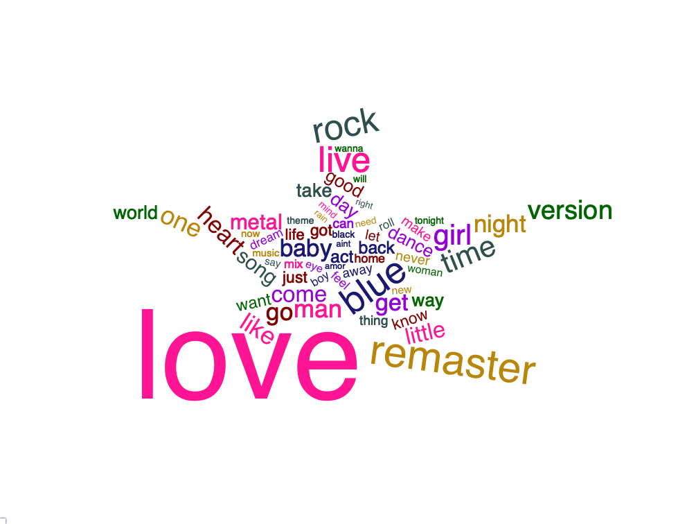

```{r connect to database, echo=FALSE, eval=TRUE, results='hide', warning = FALSE, message = FALSE}

# Libraries
library(RMySQL)
library(knitr)
library(xtable)
library(kableExtra)
library(RMariaDB)
library(DBI)
library(ggplot2)
library(dplyr)
library(reshape2)
library(stringr)
library(tm)
library(wordcloud2)
library(tidytext)
library(htmlwidgets)
library(webshot)
webshot::install_phantomjs()


# Constants
DECADE_ORDER <- c("60s\r", "70s\r", "80s\r", "90s\r", "00s\r", "10s\r")

options(xtable.comment = FALSE) #### prevents commenting when printing xtable latex

projpath <- getwd()

if(!exists("xdbsock")) {
    xdbsock <- ""
    cat("\n", 
        "Parameter 'xdbsock' not found, setting to empty string for general usage", 
        "\n")
}

drv <- dbDriver("MySQL") # create driver object


# connect to Jeremy's database
db_host <- Sys.getenv("db_read_endpoint")
db_user <- Sys.getenv("db_read_user")
db_pw   <- Sys.getenv("db_read_password")
db_port <- Sys.getenv("db_read_port")
db_name <- Sys.getenv("db_read_db")
db_drv  <- RMariaDB::MariaDB()

con <- dbConnect(db_drv, user=db_user, password=db_pw, dbname=db_name, host=db_host, port=db_port)

dbListTables(con) # see what tables we have 

dbGetInfo(con)
```

# Abstract

\vspace{12pt}

Write something

\newpage

# Introduction

REWRITE TO DESCRIBE QUESTION OF INTEREST

We analyze a database of Spotify tracks that have had attributes assigned to them algorithmically by Spotify. These attributes act as descriptors for each track and allow us to group similar tracks and identify potentially interesting information and trends in the data. We have used this to analyze the songs in the Spotify database for what we found to be the most interesting questions. In the following sections we will cover the data more in depth, describe our methodology for exploring the data, and present our final analyses.

\vspace{12pt}

# Data Description

We conducted our analysis using a dataset compiling various music features for songs found on Spotify's Web API[1]. This data was obtained by sampling two different subsets of songs, hits and flops, from 1960-2019. Hits are defined as any song that made a top 100 'hit' list any week in a given decade. Flops are defined as the opposite, with additional requirements such as belonging to a genre considered non-mainstream or avant-garde. While the original purpose of this dataset was to predict whether or not a song will be successful, we will be utilizing the musical attributes to analyze the change in music over time. Since this dataset is stratified at the track level, each track acts as a unique unit of observation. With over 40,000 unique songs spread evenly across six decades, it provides plenty of information to analyze the changes in musical attributes across the last several years.

\vspace{12pt}

The majority of these variables are generated by Spotify's music analytic algorithm, which is unknown to the general public. Therefore, we have provided documentation to get a fairly robust understanding of the variables. The definitions for all our variables can be found in the attached JSON file as well as in the dataDictionary table when connected to the database instance. 

# Methodology

This analysis will use a variety of investigative techniques to explore the data and understand music on a deeper level; answering intriguing questions about the songs we listen to but never question. We will begin by exploring the top producing artists of each decade to get a better understanding of the production of tracks over time. Just because the world's population is growing, will the number of tracks produced by artists also increase across each decade? 

We will then shift into an anaylis of song titles and what terms appear most frequently. Nowadays, it is common practice to use certain pictures and words in social media and online videos to attract wider audiences. This same logic applies to song titles. However, instead of simply displaying the most common words, we will first "clean" the song titles using the tm[2] package and tidytext[3] to gain insight on the bigger picture. This cleaning process involves converting every word into lowercase then removing non-alphabetical characters, punctuation, and stop words that  exist simply as determiners to mark nouns like “the", coordinating conjunctions like “but”, or prepositions like “in”. While these terms help to form a language, they do not hold any meaning for our song titles and were removed to decrease clutter in the text portion of the analysis. The final step of our cleaning process was to stem the text. This process alters words to return them to their root meaning. An example in our data was changing the words “remastered”, “remaster”, and “remastering” into their root: “remast”. This allows us to interpret all these separate terms as the same term. With a clean text corpus, we then created a word cloud as a method to understand the frequent concepts in song titles. 

The next method of our analysis involves a deeper dive into three main music theory attributes: tempo, time signature, and key signature. Any musician can look at sheet music, recognize these features, and immediately know exactly how to play the song. Besides the actual notes of the melody, these are the characteristics that define how a song should sound. But we will take it one step further and see how these three features effect the popularity of a song.


\newpage 

# Analysis

QUICK DESCRIPTION OF ANALYSIS

\vspace{12pt}

## Top Artists

We begin our exploratory data analysis by creating a table of the top 5 artists or bands of each decade. For the purpose of this analysis, the top artists are defined in terms of their production output, or in other words, their total amount of songs created per decade. One interesting thing this table shows is the decreasing trend in the number of tracks from top artists over each decade. In the 1960s, the top artists/bands produced over 100 tracks per decade while artists in the 2010s produced 50 or less. This indicates a potential focus on quality rather than quantity as the music industry evolves with time. 
```{r, echo=FALSE, eval=TRUE, results='asis', warning=FALSE}
qstr <-
paste0(
"
SELECT *
 FROM (
	 select artist
			, decade
			, COUNT(DISTINCT track) count_songs
			, ROW_NUMBER() OVER(PARTITION BY decade ORDER BY COUNT(DISTINCT track) desc) as rn
	from music
	group by artist, decade
	order by count_songs desc) x
WHERE rn <= 5
order by decade, rn
")

df2 <- dbGetQuery(con, qstr)
df2 <- df2[,1:3]

colnames(df2) <- c("Artist", "Decade", "Total Number of Songs")

# switch order of decades
df2_1 <- df2[1:10,]
df2_2 <- df2[-(1:10),]
df2 <- rbind(df2_2,df2_1)


# kable 
if( opts_knit$get('rmarkdown.pandoc.to') %in% 'html' ) {
  xxtb <- kable( df2, format='html', table.attr = "style='width:40% ;'"  )
  xxtb
  #kable_styling(xxtb)
}
if( opts_knit$get("rmarkdown.pandoc.to") %in% "latex" ) {
  ###### "{ }\\" -- try to create some vertical space
  xcaption <- paste0("Top 5 Artist/Bands with the Most Songs per Decade")
  rownames(df2) <- NULL
  
  xxMM <- kable(df2, format="latex", caption = xcaption, booktabs = TRUE, longtable = TRUE)

  kable_styling(xxMM, latex_options= c("hold_position","striped"), latex_table_env="longtable", repeat_header_text = "\\textit{(continued)}", repeat_header_continued = TRUE, position = "center", font_size = 9)
}


```

\newpage

## Song Titles

Like music itself, our analysis is multifaceted, so we will transition our analysis from artists to song titles. As discussed in the Methodology section above, we extracted terms from the dataset and are now able to use the wordcloud2[4] package to create the following word cloud in the shape of a star, to resemble the talented artists we just explored.

```{R, echo=FALSE, message=FALSE, eval=TRUE, results='hide', warnings = FALSE, include = FALSE}
qstr <- "SELECT track from music"
songs <- dbGetQuery(con, qstr)

corp <- VCorpus(VectorSource(songs$track))

# Removing bad characters
toSpace <- content_transformer(function(x, pattern) gsub(pattern, "[^a-zA-Z0-9]", x))

cleaned <- tm_map(corp, toSpace, "/|@|\\|")
  
# Make lowercase
cleaned <- tm_map(cleaned, content_transformer(tolower))
  
# Removing stop words and a couplt of stage directions
cleaned <- tm_map(cleaned, removeWords, c(stopwords("english")))
  
# Removing punctuation
cleaned <- tm_map(cleaned, removePunctuation)

# Removing numbers
cleaned <- tm_map(cleaned, removeNumbers)
  
# Trimming whitespace
cleaned <- tm_map(cleaned, stripWhitespace)

# Stemming
cleaned <- tm_map(cleaned, stemDocument)
  
# Removing words that become nonsence from stemming and all that
cleaned <- tm_map(cleaned, removeWords, c('zaz', 'ii', 'la', 'o', 'de', 'en', 'el', 'op'))

# fixing stemmed words
toString <- content_transformer(function(x,from,to) gsub(from, to, x))
# capitalize names/places
cleaned  <- tm_map(cleaned , toString, "danc", "dance")
cleaned  <- tm_map(cleaned , toString, "littl", "little")
cleaned  <- tm_map(cleaned , toString, "babi", "baby")


# Splitted the words
word_l <- strsplit(unlist(sapply(cleaned, '[', "content")), "[^A-Za-z']+")

# Making a tibble
tibble_total <- tibble(id = names(word_l), text=unlist(sapply(cleaned, '[', "content")))

# Getting the tokens from the tibble
tokenized <- tibble_total %>% unnest_tokens(word, text)

# Making a token frame for wordcloud 2
t.h <- data.frame(tokenized %>% count(word)) %>% subset(n > 150)

# Making the color vector
color_vec <- c('midnightblue', 'darkviolet', 'maroon','deeppink', 'darkgoldenrod', 'darkslategray', 'darkgreen')

# Getting the length for each color in the cloud
len <- round(length(t.h[["n"]])/length(color_vec))

color_vec <- rep(color_vec, rep(len, length(color_vec)))


titles <- wordcloud2(t.h, color = color_vec, shape = 'star', rotateRatio = .5)
saveWidget(titles,"tmp.html",selfcontained = F)

# and in png or pdf
webshot("tmp.html","titles.png", delay =5)
```



There are a number of key takeaways from the above plot, but we will start by asking the very question Tina Turner asked in 1984, "What's love got to do with it?" Well it appears love has a lot to do with it, with "it" being song titles. This word appears over 2000 times, which is much more than any other common word found in song titles from 1960-2019. The abundance of this makes absolute sense, since love is one of the most powerful emotions humans have put into words. So powerful, that love songs are commonly seen as more than emotion, but a genre. In addition, we see that love songs are not the only emotional genre listed in our dataset. The blues, heavily prevalent in the 1960s, also appears in the word cloud, leading us to believe that more emotive phrases are popular in song titles. 

\vspace{12pt}

Besides emotions and feelings, another topic arises as a common theme in song titles: people. More accurately, descriptions of who these people are to the artists of each song. This is reflected by the size the word “man”, “girl”, “baby”, or “boy” have in the word cloud, indicating a higher frequency in our data's song titles. Often times, people seem to talk about themselves and the people in their lives, which seems to hold true for music as well. Therefore, using just the title of the songs, we have established two significant themes in music: emotions and relationships.

\newpage

## Music Theory Attributes

Now that we've explored the artists and song titles, we will examine some of the musical attributes themselves. We will begin with three very important music theory concepts that every musician lives and breathes: tempo, time signature, and key signature. 

### Tempo

Tempo describes the speed/pace of a song. In general, fast tempos evoke more positive emotions such as happiness and delight while slow tempos evoke negative emotions such as sadness and depression. To get an idea of the artists that tend to convey postive emotions compared to those that channel negative emotions, we will take a look at the top 10 artists with the fastest average tempos as well as the top 10 with the slowest. 

```{r, echo=FALSE, eval=TRUE, results='asis', warning=FALSE}

qstr <-
paste0(
"
select artist
		, avg(tempo) avg_song_tempo
        , COUNT(DISTINCT track) count_songs
from music
group by artist
HAVING  count_songs >= 10
order by avg_song_tempo desc
limit 10
")

df1 <- dbGetQuery(con, qstr)

colnames(df1) <- c("Artist", "Average Song Tempo", "Total Number of Songs")


# kable 
if( opts_knit$get('rmarkdown.pandoc.to') %in% 'html' ) {
  xxtb <- kable( df1, format='html', table.attr = "style='width:40% ;'"  )
  xxtb
  #kable_styling(xxtb)
}
if( opts_knit$get("rmarkdown.pandoc.to") %in% "latex" ) {
  ###### "{ }\\" -- try to create some vertical space
  xcaption <- paste0("Top 10 Artist/Bands with the Fastest Average Tempos")
  rownames(df1) <- NULL
  
  xxMM <- kable(df1, format="latex", caption = xcaption, booktabs = TRUE, longtable = TRUE)

  kable_styling(xxMM, latex_options= c("hold_position","striped"), latex_table_env="longtable", repeat_header_text = "\\textit{(continued)}", repeat_header_continued = TRUE, position = "center", font_size = 9)
}


```

### Time Signature

Time signature indicates the rhythm of the song in terms of a beat's duration and the number of beats per measure. While it can get fairly technical, it is important to know that the most common time signature is 4 beats per measure (and is hence referred to as 'common time'). In fact, 88% of our dataset is made up of songs with common time. Compared to the other time signatures, common time has higher averages for danceability and energy but lower averages for acousticness. This time signature also has the highest success rate for hit songs with 43% of common time songs getting classified as a hit. As seen from the average rates in the table below, the success behind this time signature can be attributed to these songs being easier for people to dance to. Therefore, this table indicates that successful hit songs tend to higher levels of dancibility and energy. 

```{r, echo=FALSE, eval=TRUE, results='asis', warning=FALSE}
# 36117/40886

qstr <-
paste0(
"
 select time_signature
        , avg(danceability) avg_danceability
        , avg(acousticness) avg_acousticness
        , avg(energy) avg_energy
        , count(*) count_tracks
        , SUM(hit) count_hits
        , SUM(hit)/count(*) as percentage_hit
FROM music
group by time_signature
order by count_tracks desc
")

df3 <- dbGetQuery(con, qstr)

colnames(df3) <- c("Time Signature", "Average Danceability", "Average Acousticness", "Average Energy", "Number of Tracks", "Number of Hits", "Percentage of Hit Tracks")

df3 <- t(df3)

# kable 
if( opts_knit$get('rmarkdown.pandoc.to') %in% 'html' ) {
  xxtb <- kable( df3, format='html', table.attr = "style='width:40% ;'"  )
  xxtb
  #kable_styling(xxtb)
}
if( opts_knit$get("rmarkdown.pandoc.to") %in% "latex" ) {
  ###### "{ }\\" -- try to create some vertical space
  xcaption <- paste0("Summary of Time Signature Characteristics")
  colnames(df3) <- NULL
  
  xxMM <- kable(df3, format="latex", caption = xcaption, booktabs = TRUE, longtable = TRUE)

  kable_styling(xxMM, latex_options= c("hold_position","striped"), latex_table_env="longtable", repeat_header_text = "\\textit{(continued)}", repeat_header_continued = TRUE, position = "center", font_size = 9)
}
```

\newpage 

### Key Signature 

Key signature describes the combination of sharps and flats that determine the scale of a piece of music. In general, most songs shift from key to key to add variance and intrigue but this dataset simply estimates the overall key. As the table below indicates, the estimated key does not have a large effect on the success rate of songs since the 'Percentage of Hit Tracks' varies around 40% for each key.

```{r, echo=FALSE, eval=TRUE, results='asis', warning=FALSE}

qstr <-
paste0(
"
select song_key
        , avg(danceability) avg_danceability
        , avg(acousticness) avg_acousticness
        , avg(energy) avg_energy
        , count(*) count_tracks
        , SUM(hit) count_hits
        , SUM(hit)/count(*) as percentage_hit
FROM music
group by song_key
order by count_tracks desc
")

df4 <- dbGetQuery(con, qstr)

df4 <- df4[order(df4$song_key),c(1,2,3,4,7)]
df4$song_key <- c("C", "C#/Db", "D", "D#/Eb", "E","F", "F#/Gb","G", "G#/Ab","A", "A#/Bb","B")

colnames(df4) <- c("Key Signature", "Average Danceability", "Average Acousticness", "Average Energy", "Percentage of Hit Tracks")

# kable 
if( opts_knit$get('rmarkdown.pandoc.to') %in% 'html' ) {
  xxtb <- kable( df4, format='html', table.attr = "style='width:40% ;'"  )
  xxtb
  #kable_styling(xxtb)
}
if( opts_knit$get("rmarkdown.pandoc.to") %in% "latex" ) {
  ###### "{ }\\" -- try to create some vertical space
  xcaption <- paste0("Summary of Key Signature Characteristics")
  rownames(df4) <- NULL
  
  xxMM <- kable(df4, format="latex", caption = xcaption, booktabs = TRUE, longtable = TRUE)

  kable_styling(xxMM, latex_options= c("hold_position","striped"), latex_table_env="longtable", repeat_header_text = "\\textit{(continued)}", repeat_header_continued = TRUE, position = "center", font_size = 9)
}
```

## Danceability 

Through our analysis of the music theory features, we discovered the importance of danceability. This attribute is defined by Spotify as a way to describe how suitable a track is for dancing based on a combination of musical elements including tempo, rhythm stability, beat strength, and overall regularity. A value close to 0 indicates a song difficult to dance to while 1 represents dance-friendly songs. However, since we do not know the specifics of Spotify's algorithm, we will explore the correlation of this feature with other variables in our dataset. 

\vspace{6pt}

```{r echo=FALSE, message=FALSE, eval=TRUE, results='hide', warnings = FALSE, fig.height = 7, fig.width =12}

db<- "SELECT * FROM music;"
data <- dbGetQuery(con, db)

danceable <- data[,5:19] 
danceable_cor <- cor(danceable)

par(xpd=TRUE)
corrplot::corrplot(danceable_cor,
         method = 'color',
         order = 'hclust',
         type = 'lower',
         addCoef.col = 'black',
         number.cex = .5,
         tl.col = 'black',
         number.digits = 1.,
         mar = c(2, 0, 5, 0)
)
```

\newpage

TEXT TEXT TEXT

\vspace{12pt}

```{r echo=FALSE, message=FALSE, eval=TRUE, results='hide', warnings = FALSE}

# Most negatively correlated with danceability
c1 <- danceable %>% ggplot(aes(acousticness, danceability)) + geom_jitter(color = "red", alpha = 0.3) + geom_smooth(color = "black")
c2 <- danceable %>% ggplot(aes(instrumentalness, danceability)) + geom_jitter(color = "orange", alpha = 0.3) + geom_smooth(color = "black")

# Most positively correlated with danceabiity
c3 <- danceable %>% ggplot(aes(loudness, danceability)) + geom_jitter(color = "blue", alpha = 0.3) + geom_smooth(color = 'black')
c4 <- danceable %>% ggplot(aes(valence, danceability)) + geom_jitter(color = "purple", alpha = 0.3) + geom_smooth(color = 'black')

ggpubr::ggarrange(c1, c2,c3,c4)

```

\newpage 

## Attributes by Decade

TEXT TEXT TEXT

### Duration of Hit Tracks 

The duration of hit tracks is genrally under 10 minutes with an average closer to 4 minutes across the decades. One notable exception is in the 1970s, possibly due to the popularity of Progressive Rock during those years with the blending of Rock and Jazz Fusion into long, drawn-out concept albums and longer-winded tracks.

\vspace{12pt}

```{r echo=FALSE, eval=TRUE, results='hide', warning=FALSE, message = FALSE, fig.height = 3, fig.width = 6}
query5 <- "
SELECT 
  decade
  , danceability
  , liveness
  , duration_ms / 60000 AS duration -- Convert to minutes
FROM
  music
WHERE
  hit = '1'

;
"

query6 <- "
SELECT 
  decade
  , AVG(duration_ms / 60000) AS avg_duration -- Convert to minutes
  , STD(duration_ms / 60000) AS sd_duration
FROM 
  music
WHERE 
  hit = '1'
GROUP BY 
  decade

;
"

result5 <- dbGetQuery(con, query5)
result6 <- dbGetQuery(con, query6)

ggplot(data = result5, 
       aes(x = factor(decade, level = DECADE_ORDER), y = duration, color = decade)) +
  geom_point(position = position_jitter(w = 0.2)) +
  geom_errorbar(data = result6, mapping = aes(x = decade, y = avg_duration,
                  ymin = avg_duration - sd_duration,
                  ymax = avg_duration + sd_duration
                  ),
                color = 'black', width = 0.2) + 
  geom_point(data = result6, aes(x = decade, y = avg_duration), color = 'black') +
  xlab("Decade") +
  ylab("Duration (minutes)") +
  theme(legend.position = "none", plot.title = element_text(hjust = 0.5))

ggsave("Duration_By_Decade.png", device = "png", path = "plots")
```
          

### Proportion of Major/Minor Hit Tracks

The proportion of hit songs in the minor mode has increased from about 15% in the 1960s to almost 30% in the 2010s. The minor mode is associated with sadness, while the major has a happier sound. This signifies a potential trend that people have developed a taste for more depressing, saddening popular music over the last couple of decades.

\vspace{12pt}

```{r echo=FALSE, eval=TRUE, results='hide', warning=FALSE, message = FALSE, fig.height = 3, fig.width = 6}
mode_query <- "
SELECT 
  CASE 
    WHEN decade = '60s\r' THEN '1960'
    WHEN decade = '70s\r' THEN '1970'
    WHEN decade = '80s\r' THEN '1980'
    WHEN decade = '90s\r' THEN '1990'
    WHEN decade = '00s\r' THEN '2000'
    WHEN decade = '10s\r' THEN '2010'
    ELSE 'Unknown Decade'
  END
  , song_mode
FROM 
  music
WHERE
  hit = '1'
  
;
"

mode_result <- dbGetQuery(con, mode_query)
names(mode_result) <- c('decade', 'song_mode')

# Calculate proportions of each mode by decade
mode_proportions_by_decade <- mode_result %>%
  group_by(decade, song_mode) %>%
  summarize(n = n()) %>%
  mutate(mode_percent = n / sum(n) * 100)


ggplot(data = mode_proportions_by_decade, 
       aes(x = as.numeric(decade), y = mode_percent, fill = factor(song_mode))
       ) +
  geom_bar(stat = "identity") +
  xlab("Decade") + 
  ylab("Percentage") +
  scale_fill_manual(name = "Mode", # Legend options
                    labels = c("Minor", "Major"), 
                    values = c("#619CFF", "#F8766D"))+
  theme(plot.title = element_text(hjust = 0.5))

ggsave("Mode_By_Decade.png", device = "png", path = "plots")
```

\newpage

### Traits of Hit Tracks

In addition to the duration and mode of songs, there are also a few noticeable trends in the Spotify qualities of hit music across the decades. Danceability, energy, and speechiness (the use of vocals) all saw a general upward trend over time, leveling out or decreasing slightly in the 2010s. On the other hand, we see the use of acousticness, as opposed to electric instruments, in tracks decline significantly from the 60’s onward. This downward trend is align with the historical development of more electronic instruments and their widespread use. Finally, valence, which describes the musical positiveness conveyed by a track, has also been trending downward since the 80’s. This decrease agrees with our finding in the previous section that indicates people prefer sadder songs in recent years.

\vspace{12pt}

```{r echo=FALSE, eval=TRUE, results='hide', warning=FALSE, message = FALSE, fig.height = 4, fig.width = 6}
overview_query <- "
SELECT
  decade
  , danceability
  , energy
  , speechiness
  , acousticness
  , valence
FROM
  music
WHERE
  hit = '1'
"

overview_result <- dbGetQuery(con, overview_query)

avg_traits_by_decade <- overview_result %>%
  group_by(decade) %>%
  summarize_all("mean") %>%
  melt(id = "decade")

ggplot(data = avg_traits_by_decade, 
       aes(x = factor(decade, level = DECADE_ORDER), 
           y = value, color = variable)
       ) +
  geom_line(aes(group = variable), size = 1) +
  geom_point() +
  xlab("Decade") +
  ylab("Value") +
  scale_y_continuous(limits = c(0, 1.0)) +
  theme(legend.title = element_blank(), plot.title = element_text(hjust = 0.5))

ggsave("Traits_By_Decade.png", device = "png", path = "plots")
```


```{r echo=FALSE, eval=TRUE, results='hide', warning=FALSE, message = FALSE}
# Disconnect from database to clean up connection
dbDisconnect(con)
```

# Conclusions

\newpage

# Bibliography 

1. FortyTwo102. "Spotify and Billboard Top Hits Data." GitHub. Jan. & Feb., 2020. Accessed May 27, 2021. https://github.com/fortyTwo102/The-Spotify-Hit-Predictor-Dataset.

2. Ingo Feinerer, Kurt Hornik, and David Meyer (2008). Text Mining Infrastructure in R. Journal of Statistical Software 25(5): 1-54. URL: https://www.jstatsoft.org/v25/i05/.

3. Silge J, Robinson D (2016). “tidytext: Text Mining and Analysis Using Tidy Data Principles in R.” _JOSS_, *1*(3). doi: 10.21105/joss.00037 (URL: https://doi.org/10.21105/joss.00037), <URL: http://dx.doi.org/10.21105/joss.00037>.

4. Dawei Lang and Guan-tin Chien (2018). wordcloud2: Create Word Cloud by 'htmlwidget'. R package version 0.2.1. https://CRAN.R-project.org/package=wordcloud2
