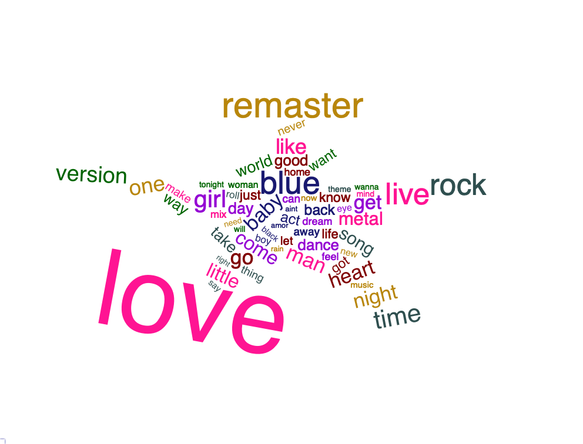

```{r connect to database, echo=FALSE, eval=TRUE, results='hide', warning = FALSE, message = FALSE}

# Libraries
library(RMySQL)
library(knitr)
library(xtable)
library(kableExtra)
library(plotly)
library(RMariaDB)
library(DBI)
library(ggplot2)
library(dplyr)
library(reshape2)
library(stringr)
library(tm)
library(wordcloud2)
library(tidytext)
library(htmlwidgets)
library(webshot)
webshot::install_phantomjs()


# Constants
DECADE_ORDER <- c("60s\r", "70s\r", "80s\r", "90s\r", "00s\r", "10s\r")

# Helper functions to get mode
getmode <- function(v) {
   uniqv <- unique(v)
   uniqv[which.max(tabulate(match(v, uniqv)))]
}

options(xtable.comment = FALSE) #### prevents commenting when printing xtable latex

projpath <- getwd()

if(!exists("xdbsock")) {
    xdbsock <- ""
    cat("\n", 
        "Parameter 'xdbsock' not found, setting to empty string for general usage", 
        "\n")
}

drv <- dbDriver("MySQL") # create driver object

# connect to Jeremy's database
db_host <- Sys.getenv("db_read_endpoint")
db_user <- Sys.getenv("db_read_user")
db_pw   <- Sys.getenv("db_read_password")
db_port <- Sys.getenv("db_read_port")
db_name <- Sys.getenv("db_read_db")
db_drv  <- RMariaDB::MariaDB()

con <- dbConnect(db_drv, user=db_user, password=db_pw, dbname=db_name, host=db_host, port=db_port)

dbListTables(con) # see what tables we have 

dbGetInfo(con)

##### make dataDictionary JSON
# yy <- dbGetQuery(con, "SELECT * FROM dataDictionary")
# writeLines(yy[ 1, "variableDefs"], file.path("~", "Desktop", "DataDictionary.json"))

```


\vspace{12pt}

# Abstract

Music has evolved significantly over the last fifty years from songs like the Beatles' "I Want to Hold Your Hand" to Taylor Swift's "Shake it Off." Although we hear these differences, how would we quantify them? Using data from Spotify, we will take a statistical approach to analyze song construction and visualize what makes particular songs timeless and others forgettable. We begin by diving into the intricacies of our dataset to help us further explore a variety of music trends over the last several decades. With a particular focus on high-producing artists, song titles, and music attributes, we will solidify the overall trends found in songs over time. We then analyze the qualities found in hit tracks and their relationship with the structure of a song. At the end of our analysis, we will have a better interpretation of musical trends and a greater understanding of the modern music world. 


\newpage

# Introduction

Everywhere we go, we are followed by melodies and catchy tunes that get stuck in our heads. But have you ever stopped to wonder why we love certain songs and have to turn off the radio for others? In this article, we will do just that by analyzing a Spotify database containing various musical attributes such as tempo, danceability, energy, and acousticness to get to the bottom of what truly makes a song popular. We will also examine if these features change over time, which would suggest a shift in musical preference as the entertainment industry, music, instruments, and we as a society evolve. 

\vspace{12pt}

# Data Description

We conducted our analysis using a dataset compiling various music features for songs found on Spotify's Web API[1]. This data was obtained by sampling two different subsets of songs from 1960-2019: hits and flops. Hits are defined as any song that made a top 100 'hit' list any week in a given decade. Flops are defined as the opposite, with additional requirements such as belonging to a genre considered non-mainstream or avant-garde. While the original purpose of this dataset was to predict whether or not a song will be successful, we will be utilizing the musical attributes to analyze the change in music over time. Since this dataset is stratified at the track level, each track acts as a unique unit of observation. With over 40,000 unique songs spread evenly across six decades, it provides plenty of information to analyze the changes in musical attributes across the last several years.

\vspace{10pt}

The majority of these variables are generated by Spotify's music analytic algorithm, which is unknown to the general public. Therefore, we have provided documentation to get a relatively robust understanding of the variables. The definitions for all our variables can be found in the attached JSON file as well as in the dataDictionary table when connected to the database instance. 

# Methodology

This analysis will use a variety of investigative techniques to explore the data and understand music on a deeper level to answer intriguing questions about the songs we listen to but never question. We will begin by exploring the top producing artists of each decade to get a better understanding of the production of tracks over time. Just because the world's population is growing, will the number of tracks produced by artists also increase across each decade? 

\vspace{10pt}

We will then shift into an analysis of song titles and what terms appear most frequently. Nowadays, it is common practice to use specific pictures and words in social media and online videos to attract wider audiences. This same logic applies to song titles. However, instead of simply displaying the most common words, we will first "clean" the song titles using the tm[2] package and tidytext[3] to gain insight of the bigger picture. This cleaning process involves converting all text to lowercase then removing non-alphabetical characters, punctuation, and stop words that exist simply as determiners to mark nouns like "the," coordinating conjunctions like "but," or prepositions like "in." While these terms help to form a language, they do not hold any meaning for our song titles and are removed to decrease clutter in the text portion of the analysis. The final step of our cleaning process was to stem the text. This process alters words to return them to their root meaning. An example in our data was changing the words "remastered," "remaster," and "remastering" into their root: "remast." This allows us to interpret all these separate terms as the same term. With a clean text corpus, we then created a word cloud as a method to understand the frequent concepts in song titles. 

\vspace{10pt}

We then continue with a univariate analysis involving a deeper dive into three main music theory attributes: tempo, time signature, and key signature. Any musician can look at sheet music, recognize these characteristics, and immediately know exactly how to play the song. We will take it one step further and compare the various levels of these features to understand their effect on the popularity of a song.

\vspace{10pt}

Finally, we will use visual analyses to explore how music has evolved in the last 50 years in relation to the number of sections that occur within a song. In combination with decades, this bivariate approach will allow us to compare and contrast the effect a song's shape has on its popularity. 

\newpage 

# Analysis

For our analysis, we will cover six aspects of our dataset that were beneficial in providing a more nuanced comprehension of musical trends in popularity. Beginning with the creators themselves, we will explore artists with high song productions for a broad view of the music industry's evolution. We then branch off to explore the song titles using text mining techniques to detect common themes in songs. From here, we will explore variables such as tempo, time signature, key signature, danceability, and energy that define what makes a song relatable and loveable. Finally, we will end by exploring the structure of songs and their relationship with musical attributes.

\vspace{12pt}

## Top Artists

We begin our exploratory data analysis by creating a table of the top 5 artists or bands of each decade. For the purpose of this analysis, the top artists are defined in terms of their production output, or in other words, their total amount of songs created per decade. One exciting concept this table shows is the decreasing trend in the number of tracks from top artists over each decade. In the 1960s, the top artists/bands produced over 100 tracks per decade, while artists in the 2010s produced 50 or less. This indicates a potential focus on quality rather than quantity as the music industry evolves with time. 

```{r, echo=FALSE, eval=TRUE, results='asis', warning=FALSE}
qstr <-
paste0(
"
SELECT *
 FROM (
	 select artist
			, decade
			, COUNT(DISTINCT track) count_songs
			, ROW_NUMBER() OVER(PARTITION BY decade ORDER BY COUNT(DISTINCT track) desc) as rn
	from music
	group by artist, decade
	order by count_songs desc) x
WHERE rn <= 5
order by decade, rn
")

df2 <- dbGetQuery(con, qstr)
df2 <- df2[,1:3]

colnames(df2) <- c("Artist", "Decade", "Total Number of Songs")

# switch order of decades
df2_1 <- df2[1:10,]
df2_2 <- df2[-(1:10),]
df2 <- rbind(df2_2,df2_1)


# kable 
if( opts_knit$get('rmarkdown.pandoc.to') %in% 'html' ) {
  xxtb <- kable( df2, format='html', table.attr = "style='width:40% ;'"  )
  xxtb
  #kable_styling(xxtb)
}
if( opts_knit$get("rmarkdown.pandoc.to") %in% "latex" ) {
  ###### "{ }\\" -- try to create some vertical space
  xcaption <- paste0("Top 5 Artist/Bands with the Most Songs per Decade")
  rownames(df2) <- NULL
  
  xxMM <- kable(df2, format="latex", caption = xcaption, booktabs = TRUE, longtable = TRUE)

  kable_styling(xxMM, latex_options= c("hold_position","striped"), latex_table_env="longtable", repeat_header_text = "\\textit{(continued)}", repeat_header_continued = TRUE, position = "center", font_size = 9)
}


```

\newpage

## Song Titles

Like music itself, our analysis is multifaceted; we will now transition our analysis from artists to song titles. As discussed in the Methodology section above, we extracted terms from the dataset and are now able to use the wordcloud2[4] package to create the following word cloud in the shape of a star, to resemble the talented artists we just explored.

```{R, echo=FALSE, message=FALSE, eval=TRUE, results='hide', warnings = FALSE, include = FALSE}
qstr <- "SELECT track from music"
songs <- dbGetQuery(con, qstr)

corp <- VCorpus(VectorSource(songs$track))

# Removing bad characters
toSpace <- content_transformer(function(x, pattern) gsub(pattern, "[^a-zA-Z0-9]", x))

cleaned <- tm_map(corp, toSpace, "/|@|\\|")
  
# Make lowercase
cleaned <- tm_map(cleaned, content_transformer(tolower))
  
# Removing stop words and a couplt of stage directions
cleaned <- tm_map(cleaned, removeWords, c(stopwords("english")))
  
# Removing punctuation
cleaned <- tm_map(cleaned, removePunctuation)

# Removing numbers
cleaned <- tm_map(cleaned, removeNumbers)
  
# Trimming whitespace
cleaned <- tm_map(cleaned, stripWhitespace)

# Stemming
cleaned <- tm_map(cleaned, stemDocument)
  
# Removing words that become nonsence from stemming and all that
cleaned <- tm_map(cleaned, removeWords, c('zaz', 'ii', 'la', 'o', 'de', 'en', 'el', 'op'))

# fixing stemmed words
toString <- content_transformer(function(x,from,to) gsub(from, to, x))
# capitalize names/places
cleaned  <- tm_map(cleaned , toString, "danc", "dance")
cleaned  <- tm_map(cleaned , toString, "littl", "little")
cleaned  <- tm_map(cleaned , toString, "babi", "baby")


# Splitted the words
word_l <- strsplit(unlist(sapply(cleaned, '[', "content")), "[^A-Za-z']+")

# Making a tibble
tibble_total <- tibble(id = names(word_l), text=unlist(sapply(cleaned, '[', "content")))

# Getting the tokens from the tibble
tokenized <- tibble_total %>% unnest_tokens(word, text)

# Making a token frame for wordcloud 2
t.h <- data.frame(tokenized %>% count(word)) %>% subset(n > 150)

# Making the color vector
color_vec <- c('midnightblue', 'darkviolet', 'maroon','deeppink', 'darkgoldenrod', 'darkslategray', 'darkgreen')

# Getting the length for each color in the cloud
len <- round(length(t.h[["n"]])/length(color_vec))

color_vec <- rep(color_vec, rep(len, length(color_vec)))


titles <- wordcloud2(t.h, color = color_vec, shape = 'star', rotateRatio = .5)
saveWidget(titles,"tmp.html",selfcontained = F)

# and in png or pdf
webshot("tmp.html","titles.png", delay =5)
```



There are a number of key takeaways from the above plot, but we will start by asking the very question Tina Turner asked in 1984, "What's love got to do with it?" Well, it appears love has a lot to do with it, with "it" being song titles. This word appears over 2000 times, which is much more than any other common word found in song titles from 1960-2019. The abundance of this makes absolute sense since love is one of the most powerful emotions humans have put into words. So powerful that love songs are commonly seen as more than emotion, but a genre. In addition, we see that love songs are not the only emotional genre listed in our dataset. The blues, heavily prevalent in the 1960s, also appears in the word cloud, leading us to believe that more emotive phrases are popular in song titles. 

\vspace{12pt}

Besides emotions and feelings, another topic arises as a common theme in song titles: people. More accurately, descriptions of who these people are to the artists of each song. This is reflected by the size the word "man," "girl," "baby," or "boy" have in the word cloud, indicating a higher frequency in our data's song titles. Oftentimes, people seem to talk about themselves and the people in their lives, which seems to hold true for music as well. Therefore, using just the title of the songs, we have established two significant themes in music: emotions and relationships.

\newpage

## Music Theory Attributes

Now that we have explored the artists and song titles, we will examine some of the musical attributes themselves. We will begin with three fundamental music theory concepts that every musician lives and breathes: tempo, time signature, and key signature. 

### Tempo

Tempo describes the speed/pace of a song. In general, fast tempos evoke more positive or intense emotions such as happiness and anger, while slow tempos evoke negative or reflective emotions such as sadness and depression. To get an idea of the artists that tend to convey positive emotions compared to those that channel negative emotions, we will take a look at the top 10 artists with the fastest average tempos as well as the top 10 with the slowest.

```{r, echo=FALSE, eval=TRUE, results='asis', warning=FALSE}

qstr <-
paste0(
"
select artist
		, avg(tempo) avg_song_tempo
        , COUNT(DISTINCT track) count_songs
from music
group by artist
HAVING  count_songs >= 10
order by avg_song_tempo desc
limit 10
")

df1 <- dbGetQuery(con, qstr)

colnames(df1) <- c("Artist", "Average Song Tempo", "Total Number of Songs")


# kable
if( opts_knit$get('rmarkdown.pandoc.to') %in% 'html' ) {
  xxtb <- kable( df1, format='html', table.attr = "style='width:40% ;'"  )
  xxtb
  #kable_styling(xxtb)
}
if( opts_knit$get("rmarkdown.pandoc.to") %in% "latex" ) {
  ###### "{ }\\" -- try to create some vertical space
  xcaption <- paste0("Top 10 Artist/Bands with the Fastest Average Tempos")
  rownames(df1) <- NULL

  xxMM <- kable(df1, format="latex", caption = xcaption, booktabs = TRUE, longtable = TRUE)

  kable_styling(xxMM, latex_options= c("hold_position","striped"), latex_table_env="longtable", repeat_header_text = "\\textit{(continued)}", repeat_header_continued = TRUE, position = "center", font_size = 9)
}


```

```{r, echo=FALSE, eval=TRUE, results='asis', warning=FALSE}

qstr <-
paste0(
"
select artist
		, avg(tempo) avg_song_tempo
        , COUNT(DISTINCT track) count_songs
from music
group by artist
HAVING  count_songs >= 10
order by avg_song_tempo
limit 10
")

df1 <- dbGetQuery(con, qstr)

colnames(df1) <- c("Artist", "Average Song Tempo", "Total Number of Songs")


# kable
if( opts_knit$get('rmarkdown.pandoc.to') %in% 'html' ) {
  xxtb <- kable( df1, format='html', table.attr = "style='width:40% ;'"  )
  xxtb
  #kable_styling(xxtb)
}
if( opts_knit$get("rmarkdown.pandoc.to") %in% "latex" ) {
  ###### "{ }\\" -- try to create some vertical space
  xcaption <- paste0("Top 10 Artist/Bands with the Slowest Average Tempos")
  rownames(df1) <- NULL

  xxMM <- kable(df1, format="latex", caption = xcaption, booktabs = TRUE, longtable = TRUE)

  kable_styling(xxMM, latex_options= c("hold_position","striped"), latex_table_env="longtable", repeat_header_text = "\\textit{(continued)}", repeat_header_continued = TRUE, position = "center", font_size = 9)
}


```

\newpage

### Time Signature

Time signature indicates the rhythm of the song in terms of a beat's duration and the number of beats per measure. While it can get fairly technical, it is essential to note that the most common time signature is four beats per measure (and is hence referred to as 'common time'). In fact, 88% of our dataset is made up of songs with common time. Compared to the other time signatures, common time has higher averages for danceability and energy but lower averages for acousticness. This time signature also has the highest success rate for hit songs, with 43% of common time songs getting classified as a hit. As seen from the average rates in the table below, the success behind this time signature can be attributed to these songs being more accessible for dancing. Therefore, this table indicates that successful hit songs tend to higher levels of danceability and energy. 

```{r, echo=FALSE, eval=TRUE, results='asis', warning=FALSE}
# 36117/40886

qstr <-
paste0(
"
 select time_signature
        , avg(danceability) avg_danceability
        , avg(acousticness) avg_acousticness
        , avg(energy) avg_energy
        , count(*) count_tracks
        , SUM(hit) count_hits
        , SUM(hit)/count(*) as percentage_hit
FROM music
group by time_signature
order by count_tracks desc
")

df3 <- dbGetQuery(con, qstr)

colnames(df3) <- c("Time Signature", "Average Danceability", "Average Acousticness", "Average Energy", "Number of Tracks", "Number of Hits", "Percentage of Hit Tracks")

df3$`Time Signature` <- as.character(df3$`Time Signature`)
df3 <- t(df3)

# kable 
if( opts_knit$get('rmarkdown.pandoc.to') %in% 'html' ) {
  xxtb <- kable( df3, format='html', table.attr = "style='width:40% ;'"  )
  xxtb
  #kable_styling(xxtb)
}
if( opts_knit$get("rmarkdown.pandoc.to") %in% "latex" ) {
  ###### "{ }\\" -- try to create some vertical space
  xcaption <- paste0("Summary of Time Signature Characteristics")
  colnames(df3) <- NULL
  
  xxMM <- kable(df3, format="latex", caption = xcaption, booktabs = TRUE, longtable = TRUE)

  kable_styling(xxMM, latex_options= c("hold_position","striped"), latex_table_env="longtable", repeat_header_text = "\\textit{(continued)}", repeat_header_continued = TRUE, position = "center", font_size = 9)
}
```

### Key Signature 

Key signature describes the combination of sharps and flats that determine the scale of a piece of music. In general, most songs shift from key to key to add variance and intrigue, but this dataset estimates the overall key. As the table below indicates, the estimated key does not have a significant effect on the success rate of songs since the 'Percentage of Hit Tracks' varies around 40% for each key.

```{r, echo=FALSE, eval=TRUE, results='asis', warning=FALSE}

qstr <-
paste0(
"
select song_key
        , avg(danceability) avg_danceability
        , avg(acousticness) avg_acousticness
        , avg(energy) avg_energy
        , count(*) count_tracks
        , SUM(hit) count_hits
        , SUM(hit)/count(*) as percentage_hit
FROM music
group by song_key
order by count_tracks desc
")

df4 <- dbGetQuery(con, qstr)

df4 <- df4[order(df4$song_key),c(1,2,3,4,7)]
df4$song_key <- c("C", "C#/Db", "D", "D#/Eb", "E","F", "F#/Gb","G", "G#/Ab","A", "A#/Bb","B")

colnames(df4) <- c("Key Signature", "Average Danceability", "Average Acousticness", "Average Energy", "Percentage of Hit Tracks")

# kable 
if( opts_knit$get('rmarkdown.pandoc.to') %in% 'html' ) {
  xxtb <- kable( df4, format='html', table.attr = "style='width:40% ;'"  )
  xxtb
  #kable_styling(xxtb)
}
if( opts_knit$get("rmarkdown.pandoc.to") %in% "latex" ) {
  ###### "{ }\\" -- try to create some vertical space
  xcaption <- paste0("Summary of Key Signature Characteristics")
  rownames(df4) <- NULL
  
  xxMM <- kable(df4, format="latex", caption = xcaption, booktabs = TRUE, longtable = TRUE)

  kable_styling(xxMM, latex_options= c("hold_position","striped"), latex_table_env="longtable", repeat_header_text = "\\textit{(continued)}", repeat_header_continued = TRUE, position = "center", font_size = 9)
}
```

## Danceability 

Through our analysis of the music theory features, we discovered the importance of danceability. This attribute is defined by Spotify as a way to describe how suitable a track is for dancing. This value is based on a combination of musical elements, including tempo, rhythm stability, beat strength, and overall regularity. A value close to 0 indicates a song is challenging to dance to; 1 represents dance-friendly songs. However, since we do not know the specifics of Spotify's algorithm, we will explore the correlation of this feature with other variables using the corrplot[5] package. 

\newpage

```{r echo=FALSE, message=FALSE, eval=TRUE, results='hide', warning = FALSE, fig.height = 7, fig.width =12}

db<- "SELECT * FROM music;"
data <- dbGetQuery(con, db)

danceable <- data[,5:19] 
danceable_cor <- cor(danceable)

par(xpd=TRUE)
corrplot::corrplot(danceable_cor,
         method = 'color',
         order = 'hclust',
         type = 'lower',
         addCoef.col = 'black',
         number.cex = .5,
         tl.col = 'black',
         number.digits = 1.,
         mar = c(2, 0, 5, 0)
)
```

\vspace{4pt}

As you can see in the correlation plot above, acousticness and instrumentalness are the most negatively correlated variables, both with a -0.3 correlation. To get a closer look at the relationship between danceability and these two variables, we will utilize the jitter plots below. 

\vspace{6pt}

```{r echo=FALSE, message=FALSE, eval=TRUE, results='hide', warnings = FALSE , fig.height = 3, fig.width = 5, fig.align="center"}

# Most negatively correlated with danceability
c1 <- danceable %>% ggplot(aes(acousticness, danceability)) + geom_jitter(color = "red", alpha = 0.3) + geom_smooth(color = "black") + theme_minimal()
c2 <- danceable %>% ggplot(aes(instrumentalness, danceability)) + geom_jitter(color = "orange", alpha = 0.3) + geom_smooth(color = "black") + theme_minimal()

# Most positively correlated with danceabiity
c3 <- danceable %>% ggplot(aes(loudness, danceability)) + geom_jitter(color = "blue", alpha = 0.3) + geom_smooth(color = 'black') + theme_minimal()
c4 <- danceable %>% ggplot(aes(valence, danceability)) + geom_jitter(color = "purple", alpha = 0.3) + geom_smooth(color = 'black') + theme_minimal()

ggpubr::ggarrange(c1, c2,c3,c4)

```

\vspace{4pt}

The first plot shows that while acousticness is negatively correlated with danceability, having acoustics in a song is the better option when it comes to making a track danceable. In addition, the top right plot shows a more consistent downward trend with instrumentalness, indicating songs with no vocals are harder for danceability. On the other hand, we found that loudness and valence are the most positively correlated variables when it comes to danceability. The bottom left plot indicates that there is a threshold of “loudness” that a song may have until it becomes less danceable. The plot on the bottom right shows that there is a steady positive correlation between valence and danceability which follows our intuition that tracks with high valence (more positive sounds) would indicate a more danceable tune to listeners.

\newpage 

## Attributes of Hit Tracks by Decade

In this section of the analysis, we will visualize the distribution of a song's duration and major/minor mode across six decades. We will also explore the trends in Spotify's defined variables, such as speechiness, acousticness, and valence.

### Duration of Song

The duration of hit tracks is generally under 10 minutes, with an average closer to 4 minutes across the decades. One notable exception is in the 1970s, possibly due to the popularity of Progressive Rock during those years with the blending of Rock and Jazz Fusion into long, drawn-out concept albums and longer-winded tracks.

\vspace{12pt}

```{r echo=FALSE, eval=TRUE, results='hide', warning=FALSE, message = FALSE, fig.height = 3, fig.width = 6, fig.align="center"}
query5 <- "
SELECT 
  decade
  , danceability
  , liveness
  , duration_ms / 60000 AS duration -- Convert to minutes
FROM
  music
WHERE
  hit = '1'

;
"

query6 <- "
SELECT 
  decade
  , AVG(duration_ms / 60000) AS avg_duration -- Convert to minutes
  , STD(duration_ms / 60000) AS sd_duration
FROM 
  music
WHERE 
  hit = '1'
GROUP BY 
  decade

;
"

result5 <- dbGetQuery(con, query5)
result6 <- dbGetQuery(con, query6)

ggplot(data = result5, 
       aes(x = factor(decade, level = DECADE_ORDER), y = duration, color = decade)) +
  geom_point(position = position_jitter(w = 0.2)) +
  geom_errorbar(data = result6, mapping = aes(x = decade, y = avg_duration,
                  ymin = avg_duration - sd_duration,
                  ymax = avg_duration + sd_duration
                  ),
                color = 'black', width = 0.2) + 
  geom_point(data = result6, aes(x = decade, y = avg_duration), color = 'black') +
  xlab("Decade") +
  ylab("Duration (minutes)") +
  theme(legend.position = "none", plot.title = element_text(hjust = 0.5)) +
  theme_minimal()

ggsave("Duration_By_Decade.png", device = "png", path = "plots")
```
          

### Proportion of Major/Minor Modes

The proportion of hit songs in the minor mode has increased from about 15% in the 1960s to almost 30% in the 2010s. The minor mode is associated with sadness, while the major has a happier sound. This signifies a potential trend that people have developed a taste for more depressing, saddening popular music over the last couple of decades.

\vspace{12pt}

```{r echo=FALSE, eval=TRUE, results='hide', warning=FALSE, message = FALSE, fig.height = 3, fig.width = 6, fig.align="center"}
mode_query <- "
SELECT 
  CASE 
    WHEN decade = '60s\r' THEN '1960'
    WHEN decade = '70s\r' THEN '1970'
    WHEN decade = '80s\r' THEN '1980'
    WHEN decade = '90s\r' THEN '1990'
    WHEN decade = '00s\r' THEN '2000'
    WHEN decade = '10s\r' THEN '2010'
    ELSE 'Unknown Decade'
  END
  , song_mode
FROM 
  music
WHERE
  hit = '1'
  
;
"

mode_result <- dbGetQuery(con, mode_query)
names(mode_result) <- c('decade', 'song_mode')

# Calculate proportions of each mode by decade
mode_proportions_by_decade <- mode_result %>%
  group_by(decade, song_mode) %>%
  summarize(n = n()) %>%
  mutate(mode_percent = n / sum(n) * 100)


ggplot(data = mode_proportions_by_decade, 
       aes(x = as.numeric(decade), y = mode_percent, fill = factor(song_mode))
       ) +
  geom_bar(stat = "identity") +
  xlab("Decade") + 
  ylab("Percentage") +
  scale_fill_manual(name = "Mode", # Legend options
                    labels = c("Minor", "Major"), 
                    values = c("#619CFF", "#F8766D"))+
  theme(plot.title = element_text(hjust = 0.5)) + theme_minimal()

ggsave("Mode_By_Decade.png", device = "png", path = "plots")
```

\newpage

### Additional Musical Qualities

In addition to the duration and mode of songs, there are also a few noticeable trends in the Spotify qualities of hit music across the decades. Danceability, energy, and speechiness (the use of vocals) all saw a generally upward trend over time, leveling out or decreasing slightly in the 2010s. On the other hand, we see the use of acoustics, as opposed to electric instruments, in tracks decline significantly from the 60's onward. This downward trend is aligned with the historical development of more electronic instruments and their widespread use. Finally, valence, which describes the musical positiveness conveyed by a track, has also been trending downward since the '80s. This decrease agrees with our finding in the previous section that indicates people prefer sadder songs in recent years.

\vspace{12pt}

```{r echo=FALSE, eval=TRUE, results='hide', warning=FALSE, message = FALSE, fig.height = 4, fig.width = 6, fig.align="center"}
overview_query <- "
SELECT
  decade
  , danceability
  , energy
  , speechiness
  , acousticness
  , valence
FROM
  music
WHERE
  hit = '1'
"

overview_result <- dbGetQuery(con, overview_query)

avg_traits_by_decade <- overview_result %>%
  group_by(decade) %>%
  summarize_all("mean") %>%
  melt(id = "decade")

ggplot(data = avg_traits_by_decade, 
       aes(x = factor(decade, level = DECADE_ORDER), 
           y = value, color = variable)
       ) +
  geom_line(aes(group = variable), size = 1) +
  geom_point() +
  xlab("Decade") +
  ylab("Value") +
  scale_y_continuous(limits = c(0, 1.0)) +
  theme(legend.title = element_blank(), plot.title = element_text(hjust = 0.5)) +
  theme_minimal()

ggsave("Traits_By_Decade.png", device = "png", path = "plots")
```

## Sections of a Song

The final portion of our analysis explores the behavior of the section variable. Each track is broken up into various sections to describe what musicians refer to as the intro, verses, pre-chorus, chorus, bridge, and outro of a song. Throughout our analysis, we have seen the effect of univariate variables on the popularity of songs and will continue with a bivariate approach using visuals to understand how music changes as the number of sections differ from track to track.

### Most Common Number of Sections 

We begin by subsetting our data into hit tracks that were featured in at least one week of the 'Billboards Top 100' list in one of the six decades in our dataset. Overall, the most common number of sections of a song is nine: intro, verse 1, pre-chorus, chorus, verse 2, pre-chorus, chorus, bridge, outro. 

\vspace{12pt}

```{r, echo=FALSE, eval=FALSE, results='hide', warning = FALSE, fig.height = 3, fig.width = 5, fig.align="center"}
# Hot-100 tracks
qstr <- paste0("SELECT track, sections FROM music WHERE hit = 1 ")
hot_sections <- dbGetQuery(con, qstr)
head(hot_sections)
hist(hot_sections$sections, main = "Histgram of hot #sections", xlab = "Number of sections")
getmode(hot_sections$sections)
# Within hot tracks, tracks with 9 sections have the highest number
```

The following line plot demonstrates the most commonly used number of sections per decade. The trend indicates that even though the overall mode is nine sections, we see an increase into the 1980s, which tend to spread their tracks into 11 sections. We then see a decrease in this variable in the 1990s, returning to the standard nine sections in the most recent years. This is likely due to the fact that many 80s songs are considered more experimental compared to the highly algorithmic way of producing songs by current music entertainers. 

\newpage

```{r, echo=FALSE, eval=TRUE, results='hide', warning = FALSE, message = FALSE, fig.height = 4, fig.width = 6, fig.align='center'}

# sections and decade
qstr <- paste0("SELECT sections, decade FROM music")
sections_decade <- dbGetQuery(con, qstr)

sections_decade$decade <- strtoi(substr(sections_decade$decade, 1, 2))
de_60 <- sections_decade[sections_decade$decade == 60, ]
de_70 <- sections_decade[sections_decade$decade == 70, ]
de_80 <- sections_decade[sections_decade$decade == 80, ]
de_90 <- sections_decade[sections_decade$decade == 90, ]
de_00 <- sections_decade[sections_decade$decade == 00, ]
de_10 <- sections_decade[sections_decade$decade == 10, ]
most_section_de <- c(getmode(de_60$sections), getmode(de_70$sections), getmode(de_80$sections), getmode(de_90$sections), getmode(de_00$sections), getmode(de_10$sections))

#x_axis <- 1:length(sections_decade$sections)

most_sections_decades <- cbind(unique(sections_decade$decade), most_section_de)
most_sections_decades <- data.frame(most_sections_decades)

colnames(most_sections_decades) <- c("Decades", "Most Common Sections")

# most_sections_decades
plot(1:length(most_section_de), most_section_de, type = "l", xlab = "Decades", ylab = "Number of Sections", xaxt = "n", yaxt = "n", main = "Most Common Number of Sections per Decade")
axis(1, at=1:length(most_section_de), labels=c("60s", "70s", "80s", "90s", "00s", "10s"))
axis(2, at = 7:12, labels=c("7","8","9","10","11","12"))
```

### Relationship with Energy and Danceability

One interesting find in regards to sections is the relationship the variable has with the average energy and danceability, both of which are nearly quadratic across the range of sections. This can be interpreted to mean that songs with a reasonable amount of sections tend to have higher energy and head-bopping melodies. For example, let us compare a pop song to a piano sonata. A pop song generally has 9-10 sections, while sonatas have approximately 20 sections. If we imagine having to tell a story in 10 chapters versus 20, it is easy to believe the story with fewer chapters will be more cramped and full of drama. The same thing applies to songs; to successfully tell a story in half the space, a pop song would have to compensate with more dramatic sounds and lyrics, hence the higher levels of energy and danceability. 
```{r, echo=FALSE, eval=TRUE, results='hide', warning = FALSE, fig.height = 3.5, fig.width =6, fig.align='center'}
# section and energy
qstr <- paste0("SELECT sections, AVG(energy) as average_energy FROM music GROUP BY sections ORDER BY sections")
sections_energy <- dbGetQuery(con, qstr)
sd_related_energy <- sections_energy[1:30, ]

# sections and danceability
qstr <- paste0("SELECT sections, AVG(danceability) as average_dance FROM music GROUP BY sections ORDER BY sections")
sections_danceability <- dbGetQuery(con, qstr)
#head(sections_danceability)
sd_related_dance = sections_danceability[1:30, ]

par(mfrow = c(1,2))

plot(sd_related_energy$sections, sd_related_energy$average_energy, xlab = "Sections", ylab = "Average Energy", type = "l")
# The relationship between sections and average energy in total range

plot(sd_related_dance$sections, sd_related_dance$average_dance, xlab = "Sections", ylab = "Average Danceability", type = "l")
# The relationship between sections and average energy in total range
```

<!-- When we look at average energy, danceability, and sections in the following 3D graph, we see a linear relationship. In simple terms, this indicates the Spotify's definition of danceability might be the same intrinsic feature as energy since they depict a very similar trend across the range of sections. Therefore, we can conclude that the ability to dance to a song is heavily reliant on the energy it conveys. The more spirited a track is, the more likely people are to boogie! -->

```{r echo=FALSE, eval=TRUE, results='hide', warning = FALSE}
sd_related_energy$average_energy <- sd_related_energy$average_energy
fig <- plot_ly(x = sd_related_energy$sections, y = sd_related_energy$average_energy, z = sd_related_dance$average_dance, type =  "scatter3d", mode = "lines")
fig <- fig %>% layout(
    title = "Relation between Sections, Energy, and Danceability",
    scene = list(
      xaxis = list(title = "Sections"),
      yaxis = list(title = "Average Energy"),
      zaxis = list(title = "Average Danceability")
    ))

# fig
```

<!--  -->

```{r echo=FALSE, eval=FALSE, results='hide', warning = FALSE}
plot(sd_related_energy$average_energy, sd_related_dance$average_dance, xlab = "average energy", ylab = "average danceability")
avgvalue_30section <- data.frame(cbind(sd_related_energy$average_energy, sd_related_dance$average_dance))
colnames(avgvalue_30section) <- c("avg_energy", "avg_danceability")
head(avgvalue_30section)
```

```{r echo=FALSE, eval=TRUE, results='hide', warning=FALSE, message = FALSE}
# Disconnect from database to clean up connection
dbDisconnect(con)
```

\newpage

# Conclusions

From this overview of Spotify songs, we have obtained an idea of the evolution of musical tastes and songwriting trends over the last several decades. Using text mining, we discovered two important themes that span across all time: emotions and relationships. Regardless of societal evolution, expressing our emotions towards the people, we care for seems to be a constant force. We also explored various aspects of our tracks, such as key and time signature, danceability, energy, duration, and acousticness. Through this section of the analysis, we discovered that people tend to prefer sad, depressing songs more in recent years. This was verified by exploring the major/minor modes as well as the valence of songs across multiple decades. 

\vspace{10pt}

A visual exploration of our section variables revealed that in the last 20 years, tracks have consistently maintained approximately nine sections. This steady approach to song structure highly suggests the introduction of a breakthrough algorithmic approach towards song creation in order to increase success potential. This ties in with our first table, which indicates that as time goes on, artists produce fewer songs per decade. The combination of these two results leads us to believe that with the expanding talent in the current entertainment industry, there has been a recent surge towards focusing on the quality of musical outputs in order to stand out. 

\vspace{10pt}

With more data and possibly the baseline of Spotify's musical attribute assignment algorithm, we could utilize our brand new knowledge for improvement, such as finding song attributes that users are most attracted to or creating a recommendation engine by clustering listener habits.

\vspace{12pt}

# Bibliography 

1. FortyTwo102. "Spotify and Billboard Top Hits Data." GitHub. Jan. & Feb., 2020. Accessed May 27, 2021. https://github.com/fortyTwo102/The-Spotify-Hit-Predictor-Dataset.

2. Ingo Feinerer, Kurt Hornik, and David Meyer (2008). Text Mining Infrastructure in R. Journal of Statistical Software 25(5): 1-54. URL: https://www.jstatsoft.org/v25/i05/.

3. Silge J, Robinson D (2016). “tidytext: Text Mining and Analysis Using Tidy Data Principles in R.” _JOSS_, *1*(3). doi: 10.21105/joss.00037 (URL: https://doi.org/10.21105/joss.00037), <URL: http://dx.doi.org/10.21105/joss.00037>.

4. Dawei Lang and Guan-tin Chien (2018). wordcloud2: Create Word Cloud by 'htmlwidget'. R package version 0.2.1. https://CRAN.R-project.org/package=wordcloud2

5. Taiyun Wei and Viliam Simko (2021). R package "corrplot": Visualization of a
Correlation Matrix (Version 0.88). Available from https://github.com/taiyun/corrplot
